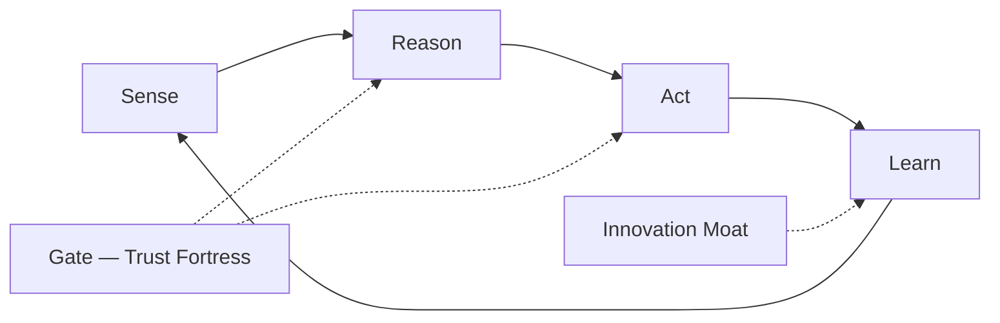

# CORE — Centralized Ops Runtime Engine

> **CORE** = **C**entralized **O**ps **R**untime **E**ngine — one fleet intelligence substrate; each **Ops lane** is a module inside CORE, not a separate runbook folder.

CORE delivers per lane: an **agentic team**, a **sense→reason→act→learn** loop, a **trust fortress**, and an **innovation moat** — operator-visible **magic** (speed, execution, performance, business outcomes).

**Registry:** [ops-programs.md](./ops-programs.md) · **Service fabric:** `bridge-os/pm/spec/service-fabric.json`  
**Machine spec:** `bridge-os/pm/spec/core-runtime-engine-protocol.json`

**Legacy alias:** ORE v1 → CORE v1 (same loop; renamed 2026-06-14).

---

## CORE loop (v1)

Every Ops lane module implements the same five-stage loop. Product engineering stays in owner repos; **CORE executes once** on the service fabric.



| Stage      | What runs                                                                  | GTCX anchors                                                                                                             |
| ---------- | -------------------------------------------------------------------------- | ------------------------------------------------------------------------------------------------------------------------ |
| **Sense**  | Telemetry, friction registers, fleet witnesses, cost stats, threat signals | `pm/*-friction-register.json`, `audit/evidence/*-latest.json`, Prometheus/CloudTrail                                     |
| **Reason** | Persona + RAG + rubric + cost-router + decision cards                      | `repo-persona-profiles`, baseline-os MCP/RAG, `five-pillar-evaluation`                                                   |
| **Act**    | P27 in-session execution; Class R/A/S split                                | Protocol 27, fabric REM delegation, ZenHub `REM-*`                                                                       |
| **Learn**  | Witness → patterns; eval-gated tool scout; meta-learning cards             | `.baseline/memory/patterns.md`, TAAS eval, `agent-tool-scout`                                                            |
| **Gate**   | Parallel sovereign lanes — never freeze product IR                         | SecOps, LegalOps, ComplianceOps, StratOps, EcosystemOps, ProductOps, DesignOps, HROps, RevOps, PayOps, `blocksIR: false` |

**Meta-learning rule:** Every CORE run writes **decision provenance** — what was sensed, which rubric fired, what was tried, exit code, witness path. The next cycle reasons over history, not chat memory.

**Magic definition:** **Compressed operator time** — one command, one Status Update, one sealed outcome — with evidence the human can trust without reading a runbook.

---

## CORE lane modules

### InfraOps

| Dimension             | Specification                                                                                                                                                      |
| --------------------- | ------------------------------------------------------------------------------------------------------------------------------------------------------------------ |
| **Runtime**           | Terraform plan/apply choreography, drift detection, cost anomaly witness, SM rotation cadence                                                                      |
| **Agentic team**      | `platform-architect` (lead) · `security-engineer` (IAM review) · fabric REM bots                                                                                   |
| **Intelligence loop** | CloudTrail + cost router → placement recommendations → apply or friction item → post-apply probe → patterns.md                                                     |
| **Innovation moat**   | Sovereign single-region mastery (af-south-1), lane-aware cost profiles, reusable modules — competitors copy repos, not the **placement + cost intelligence** graph |
| **Trust fortress**    | Kyverno, IRSA, no long-lived keys, terraform state locks, change evidence per apply                                                                                |
| **Magic**             | `pnpm daas:friction:check` → zero open P0 substrate items; env warm/cold without operator kubectl                                                                  |
| **Business outcomes** | GR-T2 pilot substrate uptime; infra spend within lane budget; audit-ready change trail                                                                             |

### DevOps

| Dimension             | Specification                                                                                           |
| --------------------- | ------------------------------------------------------------------------------------------------------- |
| **Runtime**           | Deploy choreography (P40), fleet health probe, deployment-profile contract, handoff seals               |
| **Agentic team**      | `platform-architect` · product-repo deploy liaisons (read-only cards)                                   |
| **Intelligence loop** | Cross-repo health matrix → failing repo ranked → inbound triage → smoke proof → `from-fabric-os-*` seal |
| **Innovation moat**   | **Per-repo DaaS cards** with laneId + deployProduct — fleet scales without N× bespoke runbooks          |
| **Trust fortress**    | Product repos never `kubectl apply`; deployment smoke gates; rollback evidence runbooks                 |
| **Magic**             | Product team ships feature; fabric delivers Running pod + ingress + witness — same day                  |
| **Business outcomes** | Time-to-staging ↓; fleet deploy parity; integrator pilot unblocked                                      |

### SecOps

| Dimension             | Specification                                                                                                     |
| --------------------- | ----------------------------------------------------------------------------------------------------------------- |
| **Runtime**           | WAF, network policy, pen-test calendar, CSIRT, vuln/supply-chain cadence, security cards                          |
| **Agentic team**      | `security-engineer` (lead) · `compliance-officer` (witness) · human Class S for SOW/SOC2                          |
| **Intelligence loop** | Threat + vuln signals → friction register → Class R fix or Class S intake → evidence seal → rollup                |
| **Innovation moat**   | **Stack security once** — product repos consume SECaaS cards; pen-test scope tied to lane boundaries              |
| **Trust fortress**    | Sovereign approval register; parallel gates not repo freeze; continuous hardening post point-in-time pen-test     |
| **Magic**             | Product P22 shows engineering only; SecOps gates appear as **Parallel sovereign gates** with What/Why/Implication |
| **Business outcomes** | GR-T2 trust bar; SOC2 path; reduced breach surface; faster security closure without stopping shipping             |

### MLOps

| Dimension             | Specification                                                                               |
| --------------------- | ------------------------------------------------------------------------------------------- |
| **Runtime**           | Model serve, eval pipeline, model cards, GCP ML bridge (fabric), cost-router ML paths       |
| **Agentic team**      | Intelligence product owner · `security-engineer` (model risk) · eval harness bots           |
| **Intelligence loop** | Model change → eval suite → injection red-team → promote or rollback → eval witness archive |
| **Innovation moat**   | **Eval-gated promotion** — models do not reach fleet without rubric + red-team pass         |
| **Trust fortress**    | Model cards, prompt-injection suite, anomaly-detector on AI audit events                    |
| **Magic**             | Ship model v2; CORE proves safety/quality before traffic shift — no manual checklist        |
| **Business outcomes** | AI features shippable at bank-grade bar; Mythos/intelligence differentiation                |

### AIOps

| Dimension             | Specification                                                                                   |
| --------------------- | ----------------------------------------------------------------------------------------------- |
| **Runtime**           | anomaly-detector, agent tool guard, injection red-team, fleet agent conduct checks              |
| **Agentic team**      | `security-engineer` · baseline-os runtime owner · bridge-os conduct spec                        |
| **Intelligence loop** | Agent action stream → anomaly score → throttle or escalate → post-incident pattern → scout eval |
| **Innovation moat**   | **Institutional agent conduct** (P22–P28 + persona voice) — fleet-wide, not per-IDE prompt      |
| **Trust fortress**    | Protocol 28 authority classes; vault audit; forbidden delegation patterns in conduct JSON       |
| **Magic**             | Agents execute, attest, and close — never dump operator runbooks; trust score gates custody     |
| **Business outcomes** | 10× engineering throughput without 10× incident rate                                            |

### ComplianceOps

| Dimension             | Specification                                                                                                  |
| --------------------- | -------------------------------------------------------------------------------------------------------------- |
| **Runtime**           | INT-REF lifts, five-pillar audits, reference-grade dimensions, regulatory evidence packs                       |
| **Agentic team**      | `compliance-officer` (lead) · `security-engineer` · legal witness for attestations                             |
| **Intelligence loop** | Rubric gap → INT story → dimension lift → composite witness → fleet stress report                              |
| **Innovation moat**   | **Portable compliance intelligence** — Core12 graph, GCI credential, cross-framework reference                 |
| **Trust fortress**    | Separation of duties; evidence pipeline; no normative text duplicated in product repos                         |
| **Magic**             | Product ships; compliance dimension lifts in parallel — composite crosses deploy bar without stopping features |
| **Business outcomes** | Enterprise procurement velocity; regulator-ready exports                                                       |

### LegalOps

| Dimension             | Specification                                                                                       |
| --------------------- | --------------------------------------------------------------------------------------------------- |
| **Runtime**           | Class S gate manifest, SOW/DTF/EXT-INF registers, human-gates routing                               |
| **Agentic team**      | Human sovereign · `compliance-officer` (intake witness) · agile-os ceremony owner                   |
| **Intelligence loop** | Gate detected → explainer card → Approval needed (not blocked) → human sign → witness JSON          |
| **Innovation moat**   | **Explainer-first legal gates** — no false blocks; fleet keeps executing                            |
| **Trust fortress**    | Class S never agent-signed; durable inbound tickets; canon register SoR                             |
| **Magic**             | Legal wait is visible, bounded, and non-freezing — engineering never confuses custody with blockage |
| **Business outcomes** | Faster vendor/partner closes; zero accidental protocol violations                                   |

### FleetOps

| Dimension             | Specification                                                                               |
| --------------------- | ------------------------------------------------------------------------------------------- |
| **Runtime**           | P43 intake, ZenHub sync, assurance triggers, fleet UAT, secas/daas rollups                  |
| **Agentic team**      | `protocol-engineer` (lead) · `product-strategist` (clarity) · per-repo personas (read-only) |
| **Intelligence loop** | Intake → triage → P22 selection → execute → assure → REM delegate → rollup                  |
| **Innovation moat**   | **Execution engine** — one work graph, need-based audits, no calendar theater               |
| **Trust fortress**    | Hub-scope enforcement; owner-repo implementation; vendor-assurance routing v4               |
| **Magic**             | `pnpm agent:next-work` — one story, one owner, no menus — fleet moves as one organism       |
| **Business outcomes** | Roadmap % true; sprint seals mean something; icebox clears with evidence                    |

### StratOps

| Dimension             | Specification                                                                                                                               |
| --------------------- | ------------------------------------------------------------------------------------------------------------------------------------------- |
| **Runtime**           | Growth thesis, scale model, economies-of-scale narrative, sustainability bar, moat registry, fleet north star, programmes, goal orientation |
| **Agentic team**      | `product-strategist` (lead) · `protocol-engineer` (programmes) · canon institutional baseline (read-only SoR)                               |
| **Intelligence loop** | Clarity gap → pillar recalibration → programme/moat hygiene → pilot readiness witness → progress rollup                                     |
| **Innovation moat**   | **Strategy once** — growth/scale/moat story fleet-wide; CORE lanes prove execution; competitors copy repos not the witness graph            |
| **Trust fortress**    | Goal orientation required in P22; sustainable growth ≠ roadmap-complete theater; Class S partnerships human-only                            |
| **Magic**             | One strategic headline — growth vector, scale lever, active moat, programme trace — before engineering starts                               |
| **Business outcomes** | GR-T2 → sovereign scale path; economies of scale visible; defensible continental trade stack; durable enterprise pilot readiness            |

**Functional product:** **StratAAS** — `bridge-os/pm/spec/stratops-strategy-registry.json` · [stratops-as-a-service.md](./stratops-as-a-service.md)

### EcosystemOps

| Dimension             | Specification                                                                                                            |
| --------------------- | ------------------------------------------------------------------------------------------------------------------------ |
| **Runtime**           | Partner enablement, developer programs, community champions, product-ecosystem growth, ecosystem-os publish coordination |
| **Agentic team**      | `product-strategist` · `protocol-engineer` (partner/dev programs) · ecosystem-os publish liaison                         |
| **Intelligence loop** | Network gap → enablement kit or DevRel index → community witness → partner adoption rollup → StratOps growth feedback    |
| **Innovation moat**   | **Network once** — one integrator-facing surface; partners build on trade lanes without N× bespoke onboarding decks      |
| **Trust fortress**    | Class S LOI/MOU under LegalOps; EcosystemOps runs enablement only; RevOps owns commercial witnesses                      |
| **Magic**             | Partner or developer onboards to live sandbox + publish path — not a scattered doc hunt across 16 repos                  |
| **Business outcomes** | Integrator pilot velocity; developer time-to-first-API; community-led adoption at continental scale                      |

**Functional product:** **EcosystemAAS** — `bridge-os/pm/spec/ecosystemops-network-registry.json` · [ecosystemops-as-a-service.md](./ecosystemops-as-a-service.md)

### ProductOps

| Dimension             | Specification                                                                                                 |
| --------------------- | ------------------------------------------------------------------------------------------------------------- |
| **Runtime**           | PRD index, product-goals, active milestone DoD, story→PRD trace (consumes StratOps enterprise-pilot template) |
| **Agentic team**      | `product-strategist` (lead) · bridge program office · product-repo PM liaisons (read-only cards)              |
| **Intelligence loop** | Milestone gap → product-culture check → PRD/goal hygiene → shippable witness → fleet rollup                   |
| **Innovation moat**   | **PRD dictates, roadmap executes** — `ROADMAP-COMPLETE ≠ shippable`; one product-culture protocol fleet-wide  |
| **Trust fortress**    | Proceed Brief must cite milestone + PRD ref; P22 engineering never substitutes for product definition         |
| **Magic**             | One headline: active milestone, shippable outcome, PRD trace — without sprint-count theater                   |
| **Business outcomes** | Honest done semantics; pilot-ready product integrity; feature work traces to customer value                   |

**Protocol:** `INIT-PRODUCT-DEVELOPMENT-CULTURE` — `bridge-os/pm/spec/product-development-culture-protocol.json`

### DesignOps

| Dimension             | Specification                                                                                                      |
| --------------------- | ------------------------------------------------------------------------------------------------------------------ |
| **Runtime**           | UX SoR registry, EXR packs, operator journey spine, pm/ux scaffold + deep traceability, ledger-ui design canon     |
| **Agentic team**      | `product-designer` (lead) · ledger-ui design SoR · bridge UX harness                                               |
| **Intelligence loop** | Craft/TE gap → ux-sor pack fail → scaffold or deep uplift → EXR validate → ux-sor fleet witness                    |
| **Innovation moat**   | **Auditable UX once** — scaffold ≠ deep; pilot repos prove pm/ux traceability before Craft scoring unlocks         |
| **Trust fortress**    | P21 parallel lane; demo/EXR paths persona-routed; no blank-form or dashboard-as-report anti-patterns in acceptance |
| **Magic**             | Product ships UI; DesignOps proves journey + EXR + traceability — operator demos with evidence, not wireframes     |
| **Business outcomes** | Craft pillar lift; demo-ready surfaces; continental UX consistency via shared design system                        |

**Functional product:** **UXaaS** — `bridge-os/pm/spec/ux-sor-registry.json` · Protocol P21

### HROps

| Dimension             | Specification                                                                                                                     |
| --------------------- | --------------------------------------------------------------------------------------------------------------------------------- |
| **Runtime**           | Persona roster per repo, voice embodiment, utilization proof, story-persona bind, agile squad charters, hiring backlog visibility |
| **Agentic team**      | `agile-coach` (human ceremony) · `protocol-engineer` (agentic roster) · canon institutional personas (SoR)                        |
| **Intelligence loop** | Utilization gap → persona rebind → voice/conduct witness → honest-done check → fleet team rollup                                  |
| **Innovation moat**   | **Institutional workforce once** — agents embody roles from canon, not generic chat; GATE-PERSONA-READ on commit                  |
| **Trust fortress**    | Human hiring/comp Class S only; HROps tracks visibility — never agent-signs employment or legal HR actions                        |
| **Magic**             | Every repo session names Active persona + Frame; utilization witness proves the right team worked the milestone                   |
| **Business outcomes** | World-class agentic product teams; honest Done semantics; squad clarity without sprint-count theater                              |

**Functional product:** **TeamaaS** — `bridge-os/pm/spec/hrops-workforce-registry.json` · `INIT-PRODUCT-TEAM-MODEL-R6`

### RevOps

| Dimension             | Specification                                                                                                              |
| --------------------- | -------------------------------------------------------------------------------------------------------------------------- |
| **Runtime**           | Pricing strategy, unit economics, revenue analytics, GTM revenue motion, pilot revenue witnesses, business-model economics |
| **Agentic team**      | `product-strategist` (lead) · bridge program office · FinOps witness for spend/revenue ratio                               |
| **Intelligence loop** | Revenue signal → economics rubric → pricing/GTM adjustment → pilot revenue witness → fleet rollup                          |
| **Innovation moat**   | **CRO intelligence once** — PRD economics + GTM friction + revenue analytics in one lane, not scattered in product PM      |
| **Trust fortress**    | Class S LOI/DTF under parallel gates; RevOps never holds Stripe keys or webhook secrets                                    |
| **Magic**             | One revenue headline — pricing, pilot motion, unit economics, time-to-first-dollar — without payment-rail runbooks         |
| **Business outcomes** | GR-T2 pilot revenue clarity; margin-aware GTM; honest economics in Proceed Brief                                           |

**Functional product:** **GTMaaS** (GTM revenue track) — `pm/gtm-friction-register.json` · [revops-as-a-service.md](./revops-as-a-service.md) · [gtm-as-a-service.md](./gtm-as-a-service.md)

### PayOps

| Dimension             | Specification                                                                                                    |
| --------------------- | ---------------------------------------------------------------------------------------------------------------- |
| **Runtime**           | Billing substrate (Stripe, Flutterwave, webhooks, metering) + in-product checkout + domain payout workflows      |
| **Agentic team**      | `platform-architect` (substrate) · `trade-analyst` (markets) · `field-inspector` (terra) — owner-repo for domain |
| **Intelligence loop** | Provider gap → substrate fix or domain workflow → webhook/metering witness → payops registry hygiene             |
| **Innovation moat**   | **Payment execution once** — shared SM paths and webhook matrix; domain rails (trade, gov) stay in owner repos   |
| **Trust fortress**    | PCI SAQ A boundary; LegalOps DPA; no raw card data in product pods; RevOps never touches provider custody        |
| **Magic**             | Product defines tier (RevOps); PayOps delivers live checkout + webhook + payout rail — same sprint               |
| **Business outcomes** | Time-to-first-dollar execution; fewer payment incidents; trade/gov rails never collapsed into SaaS Stripe        |

**Fleet registry:** `bridge-os/pm/spec/payops-domain-registry.json` · **Friction:** `pm/payops-friction-register.json` · [payops-as-a-service.md](./payops-as-a-service.md)

### BizOps _(legacy — merged into RevOps)_

> **BizOps** display name retired 2026-06-14. Commercial GTM friction and pilot revenue motion live under **RevOps** (CRO office). Machine ID **GTMaaS** unchanged.

### CommOps _(planned)_

| Dimension             | Specification                                                                                         |
| --------------------- | ----------------------------------------------------------------------------------------------------- |
| **Runtime**           | SendGrid, Twilio, Africa's Talking, Resend — shared keys, deliverability, template registry           |
| **Agentic team**      | `platform-architect` · `product-designer` (template UX) · `security-engineer` (phishing/abuse)        |
| **Intelligence loop** | Bounce/complaint rate → route failover → template A/B eval → deliverability witness                   |
| **Innovation moat**   | **Continental comms rail** — i18n SMS/email once; terra + terminal inherit                            |
| **Trust fortress**    | Opt-in, rate limits, PII redaction in logs, breach notification templates linked                      |
| **Magic**             | Product calls `notify(event)`; CORE picks channel, locale, provider — operator never touches API keys |
| **Business outcomes** | Activation ↑; support load ↓; trustworthy notifications at Global South scale                         |

### FinOps _(extends InfraOps)_

| Dimension             | Specification                                                                                |
| --------------------- | -------------------------------------------------------------------------------------------- |
| **Runtime**           | AWS cost audit, baseline cost-router, SaaS spend rollups (Stripe, SendGrid, LLM tokens)      |
| **Agentic team**      | `platform-architect` · bridge cost witness                                                   |
| **Intelligence loop** | Spend anomaly → lane attribution → right-size or placement shift → savings witness           |
| **Innovation moat**   | **Token + cloud unified economics** — LLM and infra in one decision frame                    |
| **Trust fortress**    | No secret leakage in cost logs; budget caps on scout pilots                                  |
| **Magic**             | `baseline cost-stats` explains spend; agents route to cheaper model without quality collapse |
| **Business outcomes** | Unit economics visible; margin protection at scale                                           |

---

## CORE meta layer

| Capability               | Owner                   | Purpose                                                   |
| ------------------------ | ----------------------- | --------------------------------------------------------- |
| **Baseline vault + MCP** | baseline-os             | Credential custody, audited tool access                   |
| **RAG + skills**         | baseline-os + bridge-os | Reason over institutional canon, not stale prompts        |
| **TAAS / tool scout**    | fabric + bridge         | Eval-gated vendor intake; extend-before-buy               |
| **Assurance triggers**   | bridge-os               | Need-based audits — story-done, PROG-25…90, BACKLOG-CLEAR |
| **Persona voice**        | canon-os                | Institutional behavior — not generic coder chat           |
| **Cost router**          | baseline-os             | Every reason step has a cost + quality tradeoff           |

**Meta-learning flywheel:**

1. CORE run produces witness JSON.
2. Witness diff feeds `patterns.md` + friction register hygiene.
3. Scout / rubric scores promote new tools or retire dead paths.
4. FleetOps rollup shows which lane lifted composite / revenue / trust.
5. Next P22 cycle prefers lanes with highest **outcome-per-token** evidence.

---

## Trust fortress (CORE-wide)

| Layer                | Mechanism                                                              |
| -------------------- | ---------------------------------------------------------------------- |
| **Authority**        | Protocol 28 — S/A/R; agents never sign Class S                         |
| **Execution**        | Protocol 27 — run commands in-session; Permission Unblock Report at D6 |
| **Selection**        | Protocol 22 — one next work item; no menus                             |
| **Communication**    | Protocol 26/45 — Proceed Brief + terminal Status Update                |
| **Parallel lanes**   | Engineering never triages SecOps/Legal/Compliance in product P22       |
| **Evidence**         | WORM audit paths; `audit/evidence/*-latest.json` SoR                   |
| **Innovation guard** | TAAS eval gate — no production vendor without rubric pass              |

---

## Innovation moat

1. **Execute once, consume everywhere** — CORE on service fabric beats per-repo ops duplication.
2. **Witness-native** — decisions are machine-readable; meta-learning is real, not retrospective docs.
3. **Persona-institutional agents** — conduct spec is fleet law; competitors have chatbots.
4. **Continental stack** — Africa's Talking + af-south-1 + mobile money paths integrated by design.
5. **Eval-gated AI** — MLOps + AIOps promote only rubric-passing automation.
6. **Trust-speed duality** — parallel gates (`blocksIR: false`) mean **fast and safe**, not fast or safe.

---

## Implementation sequence

| Phase          | CORE lanes                                                                                                                           | Deliverable                                             |
| -------------- | ------------------------------------------------------------------------------------------------------------------------------------ | ------------------------------------------------------- |
| **Now**        | SecOps, DevOps, InfraOps, FleetOps, **StratOps**, **EcosystemOps**, **ProductOps**, **DesignOps**, **HROps**, **RevOps**, **PayOps** | StratOps + EcosystemOps active; PayOps contract-defined |
| **Next**       | PayOps substrate, CommOps                                                                                                            | fabric SM + webhook matrix + `payops:providers:check`   |
| **Then**       | MLOps, AIOps depth                                                                                                                   | Eval promotion gate wired to every model/agent release  |
| **Continuous** | All                                                                                                                                  | `core-runtime-engine-protocol.json` harness per lane    |

---

## Operator entry

```bash
pnpm fabric:compass:check            # service fabric registers + runners
pnpm stratops:strategy:check:write   # StratOps structural gate
pnpm ecosystemops:network:check:write # EcosystemOps network gate
pnpm agent:next-work --json          # FleetOps selection + persona
pnpm ecosystem:assurance:evaluate    # need-based assure trigger
pnpm ecosystem:progress:report --markdown
```

**Normative companion:** [ops-programs.md](./ops-programs.md) — lane vocabulary and stable functional product IDs.
